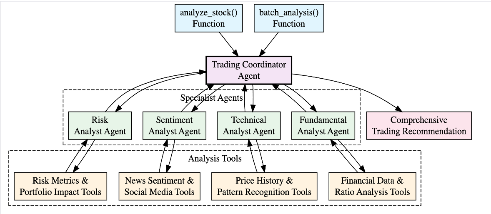

# AI-Powered Financial Analysis Agents for Capital Markets

A example framework for financial analysis and trading decision support using Strands Agents.

## Project Overview

This project demonstrates how to build sophisticated AI agents for capital markets applications using [Strands python SDK](https://github.com/strands-agents/sdk-python). It includes:

1. **Market Data Agents (Single Agent)**: Multiple deployment options for retrieving market data:
   - Amazon Bedrock (Claude models)
   - Local deployment (Ollama)

   

2. **Trading Analysis System (Multi-Agent)**: A comprehensive multi-agent system with specialized agents for:
   - Fundamental analysis
   - Technical analysis
   - Sentiment analysis
   - Risk assessment
   - Trading coordination

## Usage

### Market Data Agent (Single Agent)

The sample Market Data Agent provides access to financial data for any ticker symbol through different model backends.

```shell
# Single Agent with access to real-time market data. Use Amazon Bedrock as the model provider (requires AWS credentials)
uv run market_data/agent_bedrock_api.py AAPL

# Run with local Ollama (requires Ollama running locally)
uv run market_data/agent_ollama.py
```

See [market_data/README.md](market_data/README.md) for instructions on how to customize this agent.

### Trading Analysis System (Multi-Agent)

The sample Trading Analysis System provides comprehensive financial analysis through a multi-agent architecture.

The orchestrator agent can run the following analysis types for a given ticker symbol:

- **fundamental**
- **technical**
- **sentiment**
- **risk**

```shell
# run comprehensive analysis for a given ticker symbol - uses AWS Bedrock (requires AWS credentials)
uv run trading_analysis/agent.py TSLA

# run risk analysis only for a given ticker symbol - uses AWS Bedrock (requires AWS credentials)
uv run trading_analysis/agent.py TSLA --type risk
```

See [trading_analysis/README.md](trading_analysis/README.md) for instructions on how to customize this agent.

## Trading Analysis Agent Architecture




A hierarchical multi-agent system consists of the following specialist agents:

1. **Specialist Agents**:
   - Fundamental Analysis Agent
   - Technical Analysis Agent
   - Sentiment Analysis Agent
   - Risk Assessment Agent

2. **Coordinator Agent**:
   - Trading Advisor that synthesizes insights from specialist agents

Each specialist agent has access to specific tools relevant to their domain of expertise.

Refer to [agent.py](trading_analysis/agent.py) for full implementation details.

- `fundamental`: Valuation, growth prospects, and investment recommendations
- `technical`: Chart patterns, indicators, and entry/exit points
- `sentiment`: Market sentiment based on news and social media
- `risk`: Risk profile including market risk, volatility, and portfolio impact
- `comprehensive`: Complete analysis covering all aspects (default)

## Data Flow

1. User queries the Trading Advisor with a question about a stock
2. Trading Advisor delegates to specialist agents as needed
3. Specialist agents use their tools to gather relevant data
4. Trading Advisor synthesizes the information into a comprehensive answer
5. Final recommendation is returned to the user

## Note

This is a demonstration project using mock data generators. In a production environment, these would be replaced with real data sources and APIs.
