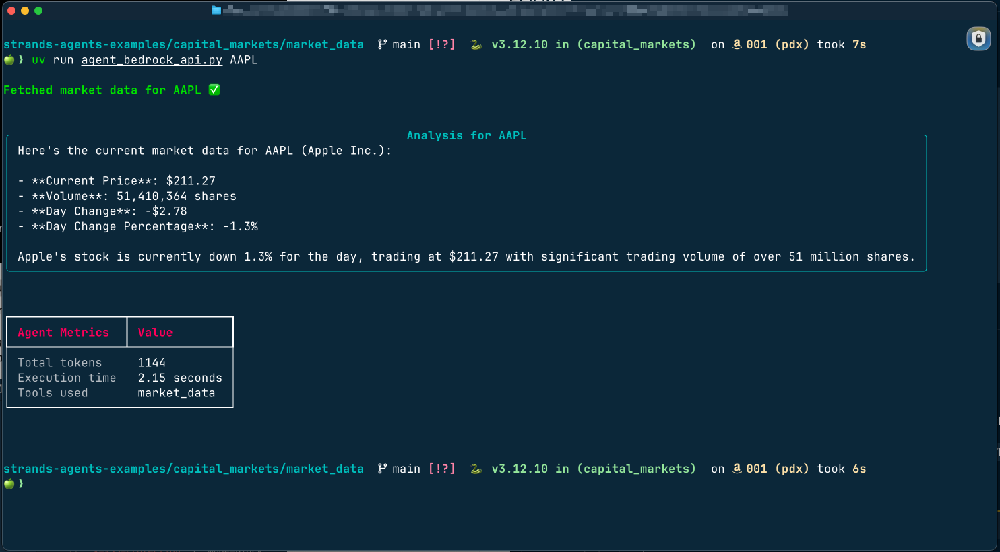

# Building Agents with Strands SDK: Market Data Agent

A simple market data agent framework for retrieving market data for any ticker symbol.
Agents are implemented using Strands SDK with Amazon Bedrock and Ollama as model providers.




>Note: This project includes both mock data generators and a real API implementation (`agent_bedrock_api.py`).
>The mock implementations (`agent_bedrock.py` and `agent_ollama.py`) demonstrate the basic structure, while the API implementation shows a production-ready approach.

## Prerequisites

- Python 3.12+
- [uv](https://astral.sh/uv) package manager
- Strands SDK

```bash
# install uv
pip install uv

# create a virtual environment
uv venv

# activate the virtual environment
source .venv/bin/activate

# install dependencies
uv sync
```

## Available Agents

This project includes three agent implementations with different model providers and data sources.

### Realtime API Agent (`agent_bedrock_api.py`)

This implementation demonstrates a complete agent that fetches actual real-time market data using the free API from [financialdatasets.ai](https://api.financialdatasets.ai).

>**NOTE:** Without an API key, only the following tickers are available: AAPL, BRK.B, GOOGL, MSFT, NVDA, TSLA

#### Features

- Real API integration with error handling
- Rich console formatting with tables and panels
- Command-line arguments for ticker specification
- Detailed metrics display (tokens used, execution time, tools used)

#### Running the Agent

```bash
# From repository root with active venv
uv run market_data/agent_bedrock_api.py AAPL  # Specify ticker (default is GOOGL if not provided)
```

This agent fetches actual price, volume, day change, and percentage change data for the specified ticker and displays the analysis in a formatted panel.

### Mock Data Agent (`agent_bedrock.py`)

This agent uses Claude models via AWS Bedrock to answer financial questions and retrieve market data.

#### Prerequisites

1. AWS account with Bedrock access
2. AWS credentials configured (one of the following):
   - AWS environment variables (`AWS_ACCESS_KEY_ID`, `AWS_SECRET_ACCESS_KEY`)
   - AWS credentials file (`~/.aws/credentials`)
   - IAM role (when running on AWS)

#### Configuration

Edit `agent_bedrock.py` to configure:

```python
bedrock_model = BedrockModel(
    model_id="us.anthropic.claude-3-7-sonnet-20250219-v1:0",  # Change model if needed
    region_name="us-west-2",  # Change to your AWS region
    temperature=0.1,  # Change to desired temperature
    top_p=0.5,  # Change to desired top_p
    # max_tokens=2048,  # Change to desired max_tokens
)
```

For custom AWS session:

- Uncomment and configure the session parameters in the `boto3.Session()` section
- Uncomment the `boto_session=session` line in the `BedrockModel` configuration

#### Running the Agent

```bash
# From repository root with active venv
uv run market_data/agent_bedrock.py
```

### Local Ollama Agent (`agent_ollama.py`)

This agent uses locally hosted models via [Ollama](https://ollama.com/) for market data retrieval.

#### Prerequisites for using Ollama Agent

1. [Ollama](https://ollama.ai/) installed and running on your machine
2. The specified model pulled (`qwen3:8b-q8_0`) or any reasoning model from [Ollama](https://ollama.com))

#### Ollama agent configuration

Edit [`agent_ollama.py`](./agent_ollama.py) to configure:

```python
ollama_model = OllamaModel(
    host="http://localhost:11434",  # Change if Ollama is on a different host/port
    model_id="qwen3:8b-q8_0",       # Change to any model available in Ollama
    temperature=0.1,
    top_p=0.5,
    max_tokens=2048,
)
```

#### Running Ollam Agent

```bash
# From repository root with active venv
uv run market_data/agent_ollama.py
```

## Example Queries

Once the agent is running, you can ask questions like:

- "What's the current trading volume for AAPL?"
- "What's the current price of TSLA?"
- "Should I buy MSFT based on its current data?"