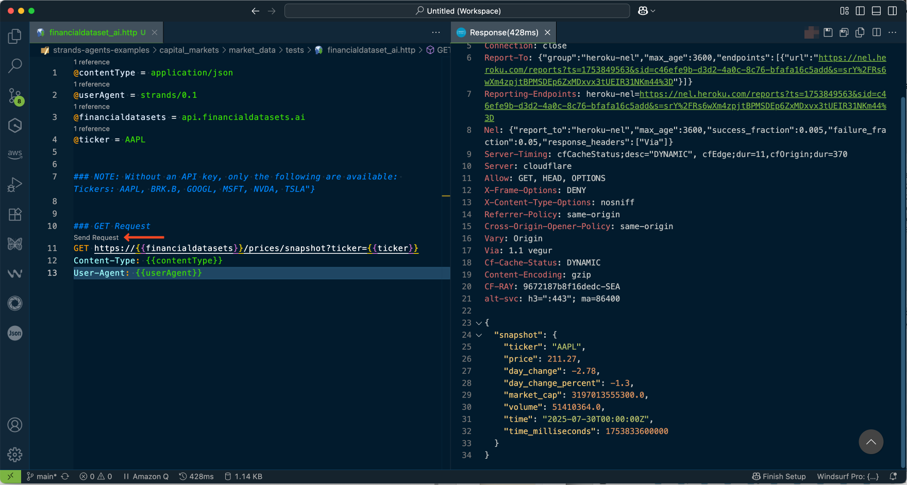

# Testing financialdatasets API endpoint

## Prerequisites

- Launch VSCode
- Install [REST Client](https://marketplace.visualstudio.com/items?itemName=humao.rest-client) extension in VSCode
- Refer to [making REST calls from VSCode](https://www.praveenc.com/posts/vscode-rest-client-extension/) post for details.

## Testing the API endpoint




Click on the "Send Request" text on to top of the GET request in the editor.

```http
@contentType = application/json
@userAgent = strands/0.1
@financialdatasets = api.financialdatasets.ai
@ticker = AAPL


GET https://{{financialdatasets}}/prices/snapshot?ticker={{ticker}}
Content-Type: {{contentType}}
User-Agent: {{userAgent}}
```